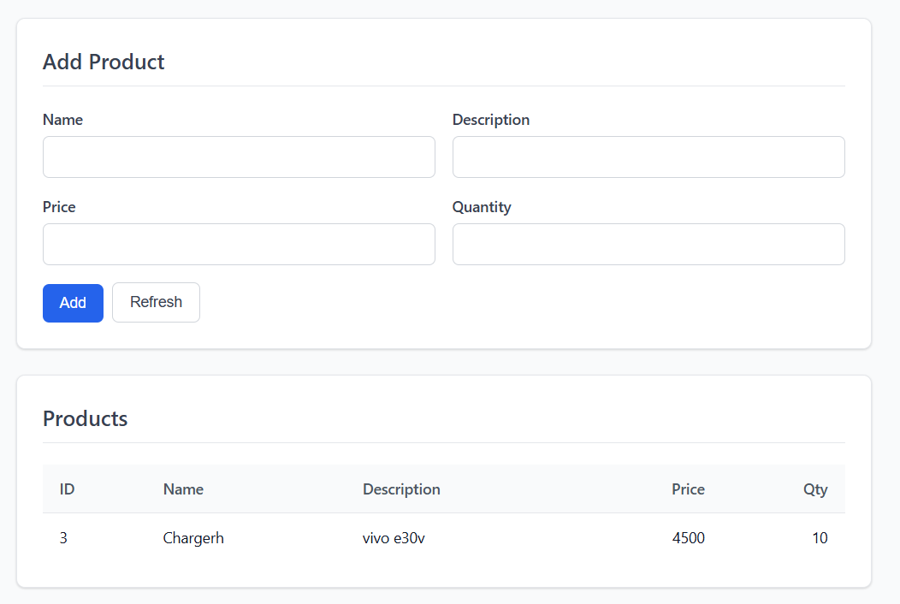
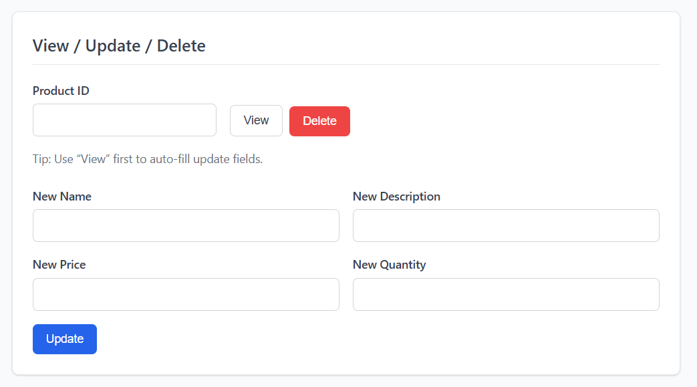
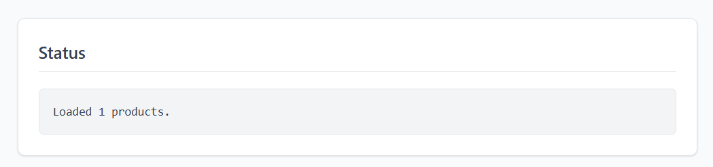

# AIDS-48_44_project

---

## 📌 Project Title
**Product CRUD Web + CLI Application (Core Java + JDBC + MySQL)**

---

## 👥 Group Members
- **Dipesh Padole** (Roll No: AIDS-48)  
- **Chaitanya Kewale** (Roll No: AIDS-44)

---

## ❗ Problem Definition
Managing product or inventory data manually using registers or spreadsheets often leads to issues such as duplicate entries, incorrect pricing, and difficulty in maintaining records. These traditional methods lack consistency and are prone to human errors.

To overcome this problem, a reliable system is required that can store product data efficiently and allow users to perform operations like adding, viewing, updating, and deleting records in a structured manner. This project provides a CRUD-based solution with database support to ensure data persistence and accuracy.

---

## ⚙️ Project Description
This project is developed using **Core Java** for backend logic and **JDBC** for database connectivity with **MySQL**. It supports both **Command Line Interface (CLI)** and **Web-based Interface**.

### 🔹 Working (Web Mode)
1. The frontend (`index.html`, `index.css`) runs in the browser.
2. JavaScript sends HTTP requests to the Java backend server.
3. The server processes requests and interacts with `ProductDAO`.
4. `ProductDAO` executes SQL queries using JDBC.
5. Data is stored and retrieved from the MySQL database (`ecommerce`).

### 🔹 Technologies Used
- Core Java  
- JDBC (DriverManager, PreparedStatement)  
- MySQL Database  
- MySQL Connector/J  
- Java HTTP Server (`HttpServer`)  
- HTML, CSS, JavaScript  

---

## 🚀 Features
- Perform **CRUD operations** (Create, Read, Update, Delete)
- Persistent data storage using MySQL
- Secure database handling using `PreparedStatement`
- Web-based UI for user interaction
- REST-style API support:
  - `GET /api/products`
  - `GET /api/products/{id}`
  - `POST /api/products`
  - `PUT /api/products/{id}`
  - `DELETE /api/products/{id}`
- CLI-based interface for quick testing

---

## 📸 Screenshots
### Screenshot 1


### Screenshot 2


### Screenshot 3


---

## 🗄️ Database Connectivity Code

```java
package util;

import java.sql.Connection;
import java.sql.DriverManager;
import java.sql.SQLException;

public class DBConnection {

    private static final String URL = "jdbc:mysql://localhost:3306/ecommerce";
    private static final String USER = "root";
    private static final String PASSWORD = "pass123";

    public static Connection getConnection() throws SQLException {
        try {
            Class.forName("com.mysql.cj.jdbc.Driver");
        } catch (ClassNotFoundException e) {
            throw new SQLException("MySQL JDBC Driver not found.", e);
        }

        return DriverManager.getConnection(URL, USER, PASSWORD);
    }
}
